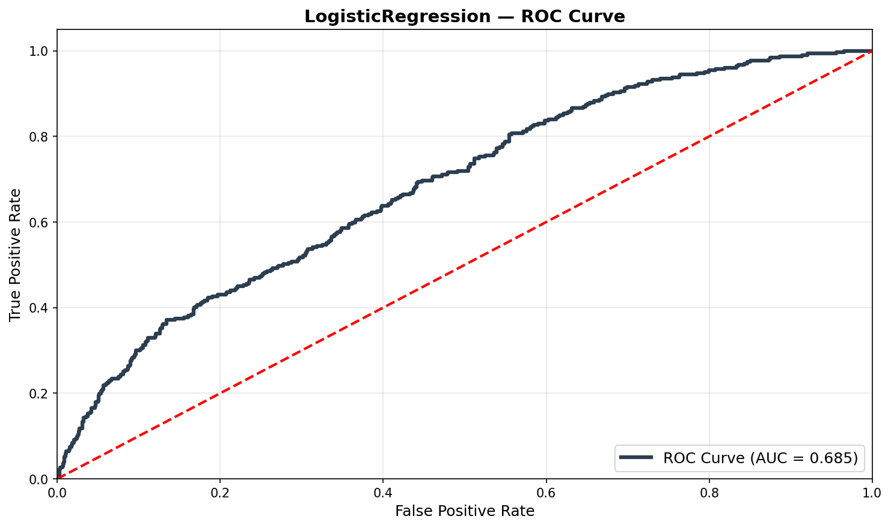
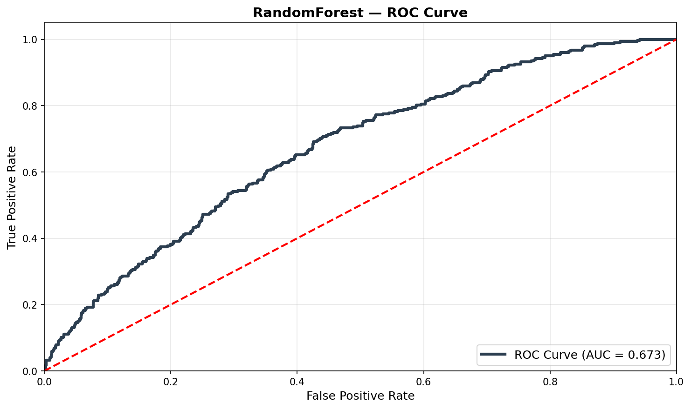
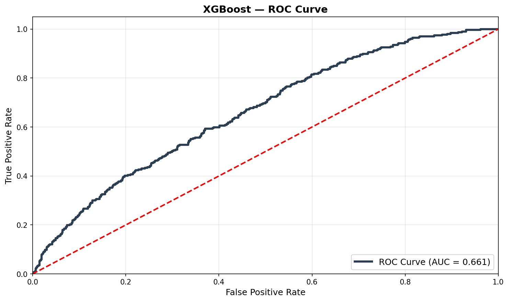
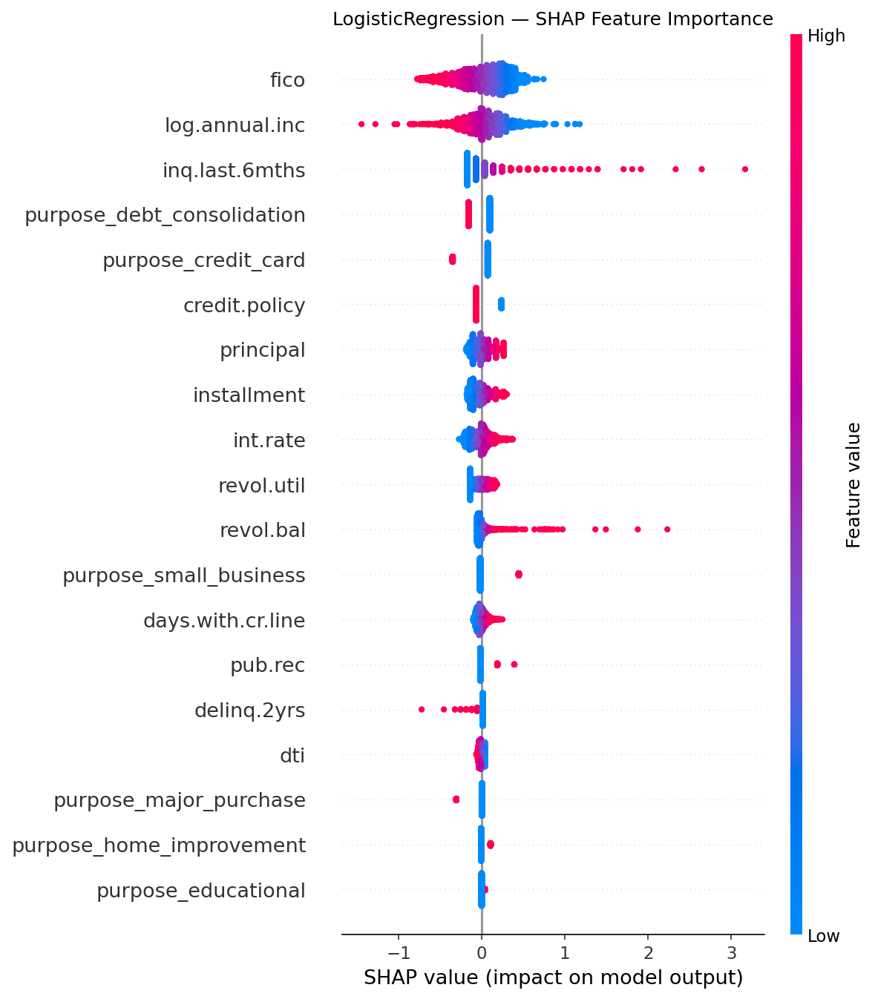
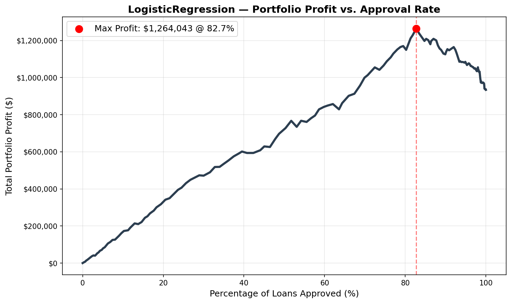
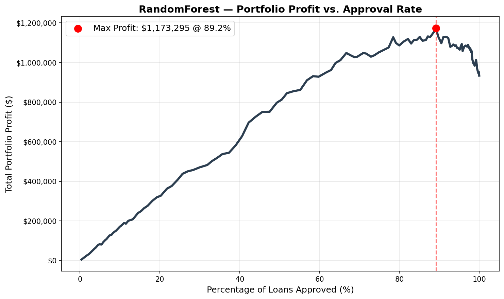
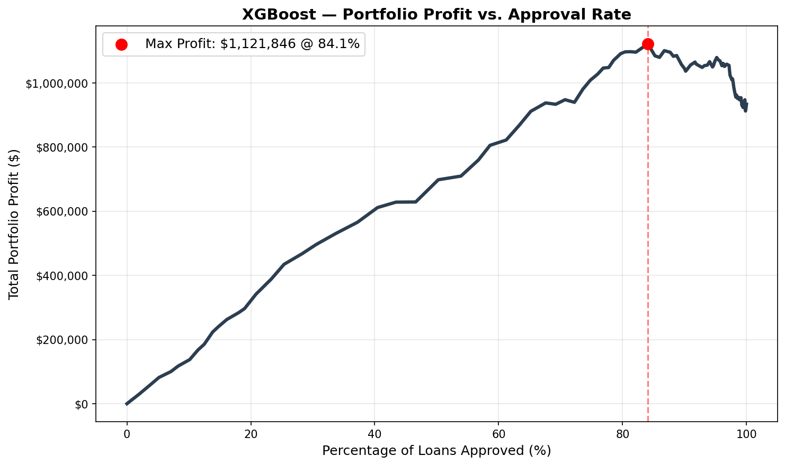

```{=html}
<style>
.metric-grid {
  display: grid;
  grid-template-columns: repeat(3, 1fr);
  gap: 1rem;
  margin: 1.5rem 0 2rem 0;
}
.metric-card {
  background: #f8f9fa;
  border-left: 4px solid #2c5f8a;
  border-radius: 4px;
  padding: 1rem 1.25rem;
}
.metric-value {
  font-size: 1.6rem;
  font-weight: 700;
  color: #2c5f8a;
  line-height: 1.1;
}
.metric-label {
  font-size: 0.8rem;
  color: #555;
  margin-top: 0.2rem;
  text-transform: uppercase;
  letter-spacing: 0.04em;
}
.metric-sub {
  font-size: 0.75rem;
  color: #888;
  margin-top: 0.15rem;
}
.results-table th {
  background: #f0f4f8;
}
.back-link {
  font-size: 0.9rem;
  margin-bottom: 1.5rem;
  display: block;
}
@media (max-width: 600px) {
  .metric-grid { grid-template-columns: 1fr 1fr; }
}
</style>

<a class="back-link" href="../projects.html">
  <span class="lang-en">← Back to Projects</span>
  <span class="lang-pt">← Voltar aos Projetos</span>
</a>

<div class="metric-grid">
  <div class="metric-card">
    <div class="metric-value">$1,264,043</div>
    <div class="metric-label">
      <span class="lang-en">Optimal Portfolio Profit</span>
      <span class="lang-pt">Lucro Ótimo do Portfólio</span>
    </div>
    <div class="metric-sub">
      <span class="lang-en">Logistic Regression, test set</span>
      <span class="lang-pt">Regressão Logística, conjunto de teste</span>
    </div>
  </div>
  <div class="metric-card">
    <div class="metric-value">+35.4%</div>
    <div class="metric-label">
      <span class="lang-en">ROI Lift vs. Approve All</span>
      <span class="lang-pt">Ganho de ROI vs. Aprovar Tudo</span>
    </div>
    <div class="metric-sub">$933,898 → $1,264,043</div>
  </div>
  <div class="metric-card">
    <div class="metric-value">9,578</div>
    <div class="metric-label">
      <span class="lang-en">Consumer Loans</span>
      <span class="lang-pt">Empréstimos ao Consumidor</span>
    </div>
    <div class="metric-sub">LendingClub · 16% default rate</div>
  </div>
</div>
```

---

## <span class="lang-en">The Problem with Optimizing Accuracy</span><span class="lang-pt">O Problema de Otimizar Acurácia</span>

<span class="lang-en">A model that predicts "fully paid" for every single applicant achieves 84% accuracy on this dataset — because 84% of loans are actually repaid. That model is useless. It approves every default and leaves $330,145 in recoverable profit on the table.</span>
<span class="lang-pt">Um modelo que prevê "pagamento total" para todos os solicitantes atinge 84% de acurácia neste dataset — porque 84% dos empréstimos são de fato pagos. Esse modelo é inútil. Ele aprova todos os inadimplentes e deixa $330.145 em lucro recuperável na mesa.</span>

<span class="lang-en">Standard classification metrics — accuracy, F1-score — are blind to the asymmetry of credit risk. A missed default costs far more than a rejected good applicant. **The correct objective function is portfolio net profit, not classification accuracy.**</span>
<span class="lang-pt">Métricas padrão de classificação — acurácia, F1-score — são cegas à assimetria do risco de crédito. Um default perdido custa muito mais do que um bom solicitante rejeitado. **A função objetivo correta é o lucro líquido do portfólio, não a acurácia de classificação.**</span>

<span class="lang-en">This project builds a credit scoring engine that makes that substitution explicitly — replacing the classification threshold with a profit-maximizing approval rate, grounded in the actual P&L structure of the loan portfolio.</span>
<span class="lang-pt">Este projeto constrói um motor de scoring de crédito que faz essa substituição explicitamente — trocando o threshold de classificação por uma taxa de aprovação que maximiza o lucro, fundamentada na estrutura real de P&L do portfólio de empréstimos.</span>

---

## <span class="lang-en">Financial Engineering: Reconstructing the Asset</span><span class="lang-pt">Engenharia Financeira: Reconstruindo o Ativo</span>

<span class="lang-en">The dataset provides monthly installment amounts and interest rates, but not the loan principal — the capital at risk in a default scenario. Before any modeling, the principal must be derived. I applied the **Present Value of an Annuity** formula, assuming a 36-month fixed term:</span>
<span class="lang-pt">O dataset fornece valores de parcelas mensais e taxas de juros, mas não o principal do empréstimo — o capital em risco em um cenário de inadimplência. Antes de qualquer modelagem, o principal deve ser derivado. Apliquei a fórmula do **Valor Presente de uma Anuidade**, assumindo prazo fixo de 36 meses:</span>

$$P = A \times \frac{1 - (1 + r/12)^{-36}}{r/12}$$

<span class="lang-en">where $A$ is the monthly installment and $r$ is the annual interest rate. This engineered `principal` feature becomes the foundation of the profit function — it defines exactly how much capital is lost when a loan defaults.</span>
<span class="lang-pt">onde $A$ é a parcela mensal e $r$ é a taxa de juros anual. Essa feature engenheirada `principal` torna-se a base da função de lucro — ela define exatamente quanto capital é perdido quando um empréstimo entra em default.</span>

### <span class="lang-en">The Profit Function</span><span class="lang-pt">A Função de Lucro</span>

<span class="lang-en">Each loan approval decision maps to one of three financial outcomes:</span>
<span class="lang-pt">Cada decisão de aprovação de empréstimo mapeia para um de três resultados financeiros:</span>

| <span class="lang-en">Outcome</span><span class="lang-pt">Resultado</span> | <span class="lang-en">Formula</span><span class="lang-pt">Fórmula</span> | <span class="lang-en">Interpretation</span><span class="lang-pt">Interpretação</span> |
|---|---|---|
| <span class="lang-en">Approved, repaid (TN)</span><span class="lang-pt">Aprovado, pago (TN)</span> | $(installment \times 36) - principal$ | <span class="lang-en">Total interest income</span><span class="lang-pt">Receita total de juros</span> |
| <span class="lang-en">Approved, defaulted (FN)</span><span class="lang-pt">Aprovado, inadimplente (FN)</span> | $(principal \times 0.30) - principal = -0.70 \times principal$ | <span class="lang-en">Net loss after 30% recovery</span><span class="lang-pt">Perda líquida após 30% de recuperação</span> |
| <span class="lang-en">Rejected (any class)</span><span class="lang-pt">Rejeitado (qualquer classe)</span> | $0$ | <span class="lang-en">Opportunity cost — no gain or loss</span><span class="lang-pt">Custo de oportunidade — sem ganho ou perda</span> |

<span class="lang-en">The 30% recovery rate reflects industry approximations for unsecured consumer debt. Assumptions not modeled: cost of capital (assumed 0%), time value of money, and prepayment risk — all documented as future work.</span>
<span class="lang-pt">A taxa de recuperação de 30% reflete aproximações do setor para dívida não garantida ao consumidor. Premissas não modeladas: custo de capital (assumido 0%), valor do dinheiro no tempo e risco de pré-pagamento — todos documentados como trabalho futuro.</span>

---

## <span class="lang-en">The Strategy Curve</span><span class="lang-pt">A Curva de Estratégia</span>

<span class="lang-en">The core of the engine is not a classifier — it is a **strategy curve**: a sweep across 200 candidate thresholds (0.01–0.99) that computes realized portfolio profit at each approval rate. A loan is approved when its predicted default probability falls below the threshold. The optimal threshold is determined empirically per model, not fixed at 0.5.</span>
<span class="lang-pt">O núcleo do motor não é um classificador — é uma **curva de estratégia**: uma varredura por 200 thresholds candidatos (0,01–0,99) que computa o lucro realizado do portfólio em cada taxa de aprovação. Um empréstimo é aprovado quando sua probabilidade prevista de default está abaixo do threshold. O threshold ótimo é determinado empiricamente por modelo, não fixado em 0,5.</span>


<span class="lang-en">The comparison above shows all three models against the naive baseline ($933,898 — approve all applicants). Every model outperforms the baseline at its optimal threshold. Logistic Regression achieves the highest portfolio profit despite having the lowest raw accuracy — a result that requires explanation.</span>
<span class="lang-pt">A comparação acima mostra os três modelos versus a baseline ingênua ($933.898 — aprovar todos os solicitantes). Cada modelo supera a baseline no seu threshold ótimo. A Regressão Logística atinge o maior lucro do portfólio apesar de ter a menor acurácia bruta — um resultado que requer explicação.</span>

---

## <span class="lang-en">Model Benchmarking</span><span class="lang-pt">Benchmarking de Modelos</span>

<span class="lang-en">Three models were tuned via `RandomizedSearchCV` (35 iterations, 3-fold CV, AUC scoring) on an 80/20 stratified split. All models handle the 16% default class imbalance explicitly — Logistic Regression and Random Forest via `class_weight='balanced'`; XGBoost via `scale_pos_weight`.</span>
<span class="lang-pt">Três modelos foram ajustados via `RandomizedSearchCV` (35 iterações, CV de 3 folds, scoring por AUC) em uma divisão estratificada 80/20. Todos os modelos tratam explicitamente o desbalanceamento de 16% da classe de default — Regressão Logística e Random Forest via `class_weight='balanced'`; XGBoost via `scale_pos_weight`.</span>

<span class="lang-en">All results verified on the held-out 2024 test set (1,916 loans):</span>
<span class="lang-pt">Todos os resultados verificados no conjunto de teste (1.916 empréstimos):</span>

| <span class="lang-en">Model</span><span class="lang-pt">Modelo</span> | AUC | <span class="lang-en">Accuracy</span><span class="lang-pt">Acurácia</span> | <span class="lang-en">Optimal Threshold</span><span class="lang-pt">Threshold Ótimo</span> | <span class="lang-en">Approval Rate</span><span class="lang-pt">Taxa de Aprovação</span> | <span class="lang-en">Portfolio Profit</span><span class="lang-pt">Lucro do Portfólio</span> | <span class="lang-en">ROI Lift</span><span class="lang-pt">Ganho de ROI</span> |
|---|---|---|---|---|---|---|
| **Logistic Regression** | **0.685** | 64.0% | 0.606 | 82.7% | **$1,264,043** | **+35.4%** |
| Random Forest | 0.673 | 82.2% | 0.453 | 89.2% | $1,173,295 | +25.6% |
| XGBoost | 0.661 | 83.7% | 0.246 | 84.1% | $1,121,846 | +20.1% |
| *<span class="lang-en">Baseline (approve all)</span><span class="lang-pt">Baseline (aprovar tudo)</span>* | *—* | *84.0%* | *—* | *100%* | *$933,898* | *—* |

### <span class="lang-en">Why Logistic Regression Wins</span><span class="lang-pt">Por Que a Regressão Logística Vence</span>

<span class="lang-en">XGBoost achieves 83.7% accuracy — but look at its confusion matrix: it assigns recall of 0.01 to the default class, meaning it correctly identifies almost no defaults. It achieves high accuracy by predicting "fully paid" for nearly everyone, which is identical to the naive baseline in behavior. High accuracy here is a symptom of the problem, not a solution to it.</span>
<span class="lang-pt">O XGBoost atinge 83,7% de acurácia — mas observe sua matriz de confusão: ele atribui recall de 0,01 à classe de default, significando que identifica corretamente quase nenhum inadimplente. Atinge alta acurácia prevendo "pagamento total" para quase todos, o que é idêntico ao comportamento da baseline ingênua. Alta acurácia aqui é um sintoma do problema, não uma solução.</span>

<span class="lang-en">Logistic Regression with `class_weight='balanced'` accepts lower overall accuracy (64%) in exchange for genuine sensitivity to defaults (recall=0.58). The `class_weight` adjustment re-weights the loss function so that misclassifying a default is penalized proportionally to its financial cost. This is the correct behavior when the objective is profit, not classification score.</span>
<span class="lang-pt">A Regressão Logística com `class_weight='balanced'` aceita menor acurácia geral (64%) em troca de sensibilidade genuína aos inadimplentes (recall=0,58). O ajuste de `class_weight` reponde à função de perda para que classificar incorretamente um default seja penalizado proporcionalmente ao seu custo financeiro. Esse é o comportamento correto quando o objetivo é lucro, não pontuação de classificação.</span>

---

## <span class="lang-en">Model Analysis</span><span class="lang-pt">Análise do Modelo</span>

### <span class="lang-en">ROC Curves</span><span class="lang-pt">Curvas ROC</span>

::: {.grid}

::: {.g-col-12 .g-col-md-4}

:::

::: {.g-col-12 .g-col-md-4}

:::

::: {.g-col-12 .g-col-md-4}

:::

:::

### <span class="lang-en">Feature Importance (SHAP)</span><span class="lang-pt">Importância das Features (SHAP)</span>



<span class="lang-en">SHAP analysis on the selected Logistic Regression model reveals three dominant risk drivers:</span>
<span class="lang-pt">A análise SHAP no modelo de Regressão Logística selecionado revela três principais fatores de risco:</span>

<span class="lang-en">**FICO score** is the strongest monotonic predictor of creditworthiness — higher scores strongly reduce predicted default probability, consistent with its role as a standardized creditworthiness signal.</span>
<span class="lang-pt">O **FICO score** é o preditor monotônico mais forte de solvência — scores mais altos reduzem fortemente a probabilidade prevista de default, consistente com seu papel como sinal padronizado de crédito.</span>

<span class="lang-en">**Credit inquiries in the last 6 months** (`inq.last.6mths`) is the second most important feature. High credit-seeking velocity is a well-documented distress signal — applicants approaching multiple lenders simultaneously are more likely to be facing liquidity constraints.</span>
<span class="lang-pt">**Consultas de crédito nos últimos 6 meses** (`inq.last.6mths`) é a segunda feature mais importante. Alta velocidade de busca de crédito é um sinal documentado de dificuldade financeira — solicitantes que abordam múltiplos credores simultaneamente têm maior probabilidade de enfrentar restrições de liquidez.</span>

<span class="lang-en">**Interest rate** (`int.rate`) confirms that riskier loans are priced higher — but also that the risk premium embedded in the rate is often insufficient to offset default losses in the lowest credit quality deciles, where rejecting the applicant outright is more profitable than extending credit.</span>
<span class="lang-pt">**Taxa de juros** (`int.rate`) confirma que empréstimos mais arriscados têm precificação mais alta — mas também que o prêmio de risco embutido na taxa frequentemente é insuficiente para compensar as perdas por default nos decis de menor qualidade de crédito, onde rejeitar o solicitante é mais lucrativo do que conceder crédito.</span>

### <span class="lang-en">Individual Strategy Curves</span><span class="lang-pt">Curvas de Estratégia Individuais</span>

::: {.grid}

::: {.g-col-12 .g-col-md-4}

:::

::: {.g-col-12 .g-col-md-4}

:::

::: {.g-col-12 .g-col-md-4}

:::

:::

---

## <span class="lang-en">Conclusion</span><span class="lang-pt">Conclusão</span>

- <span class="lang-en">Reframed loan approval as a financial optimization problem — replacing accuracy with portfolio net profit as the objective function, grounded in the P&L structure of the loan asset.</span><span class="lang-pt">Reformulou a aprovação de empréstimos como um problema de otimização financeira — substituindo acurácia por lucro líquido do portfólio como função objetivo, fundamentada na estrutura de P&L do ativo de empréstimo.</span>
- <span class="lang-en">Derived loan principal from installment data using the PV of an annuity formula — enabling a realistic profit calculation where none was possible with raw features alone.</span><span class="lang-pt">Derivou o principal do empréstimo a partir dos dados de parcelas usando a fórmula do VP de uma anuidade — possibilitando um cálculo de lucro realista onde nenhum era possível com as features brutas.</span>
- <span class="lang-en">Demonstrated that high accuracy (84% for XGBoost) can be financially worse than lower accuracy (64% for Logistic Regression) — when the model with high accuracy achieves it by ignoring the minority class that drives the most capital loss.</span><span class="lang-pt">Demonstrou que alta acurácia (84% para XGBoost) pode ser financeiramente pior do que menor acurácia (64% para Regressão Logística) — quando o modelo com alta acurácia a alcança ignorando a classe minoritária que gera as maiores perdas de capital.</span>

---

```{=html}
<hr style="margin-top: 2rem;">
<p style="font-size: 0.85rem; color: #555;">
  <strong>Stack:</strong>
  Python · scikit-learn · XGBoost · pandas · SHAP · Matplotlib
  &nbsp;|&nbsp;
  <a href="https://github.com/Condeg0/Loan-Default-Prediction" target="_blank">
    <span class="lang-en">View on GitHub →</span>
    <span class="lang-pt">Ver no GitHub →</span>
  </a>
  &nbsp;|&nbsp;
  <a href="../projects.html">
    <span class="lang-en">← Back to Projects</span>
    <span class="lang-pt">← Voltar aos Projetos</span>
  </a>
</p>
```
