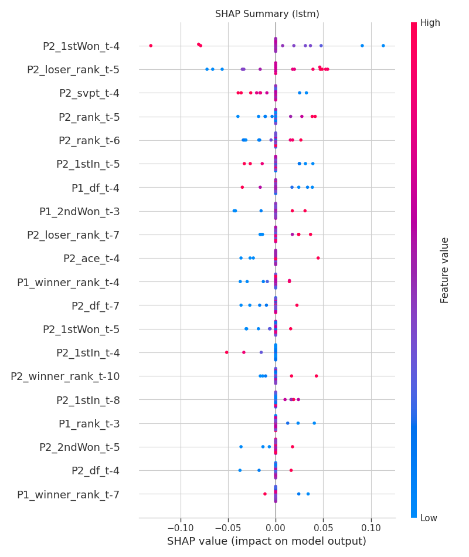

## Featured Case Studies

::: {.grid}

::: {.g-col-12 .g-col-md-6}
### BreakPoint AI: ATP Tennis Forecasting

**Stack:** Python, PyTorch (LSTMs), Optuna, Time-Series Analysis

**The Problem:** Sports betting markets are highly efficient. Standard models fail to beat the "closing line" because they rely on static averages rather than dynamic form.

**The Solution:** I built a **Hybrid Siamese LSTM** network that models a match as the collision of two historical trajectories (momentum), rather than static player stats.

* **Innovation:** Strict `date < current_date` filtration to prevent look-ahead bias (data leakage).
* **Result:** Achieved **64.6% Accuracy** and **0.706 AUC**, reaching parity with institutional bookmakers.

[**View Technical Report &rarr;**](./tennis-forecast/index.html){.btn .btn-primary}
:::

::: {.g-col-12 .g-col-md-6}
### Optimizing Credit Risk: Profit-First Logic

**Stack:** Python, Scikit-Learn, Pandas, Financial Engineering

**The Problem:** Standard classification models maximize *accuracy*, but banks care about *profit*. A default costs significantly more than a rejected loan saves.

**The Solution:** I engineered a **Threshold Optimization Engine** that shifts the decision boundary based on the specific cost-benefit matrix of the loan portfolio.

* **Strategy:** Prioritized recall for high-risk segments.
* **Result:** Projected **~40% ROI lift** ($1.26M portfolio value) compared to standard accuracy-based thresholds.

[**View Full Analysis &rarr;**](./Loan-Default-Prediction/index.html){.btn .btn-primary}
:::

::: {.g-col-12 .g-col-md-6}
### NYC Ride-Share Demand Analysis

**Stack:** R (ggplot2, dplyr), Geospatial Analysis

**The Problem:** Drivers face a "Cold Start" problem: knowing where to position themselves *before* demand spikes to minimize unpaid wait times.

**The Solution:** I conducted a spatiotemporal analysis of 4.5M+ Uber pickups to identify high-density clusters and recurring time-based demand cycles.

* **Insight:** Identified a non-linear demand surge on Thursdays (commuter vs. nightlife shifts).
* **Application:** Developed heatmaps acting as "Pre-Surge" indicators for fleet positioning.

[**View Visual Analysis &rarr;**](./Uber-NYC-Analysis/index.html){.btn .btn-primary}
:::

:::
