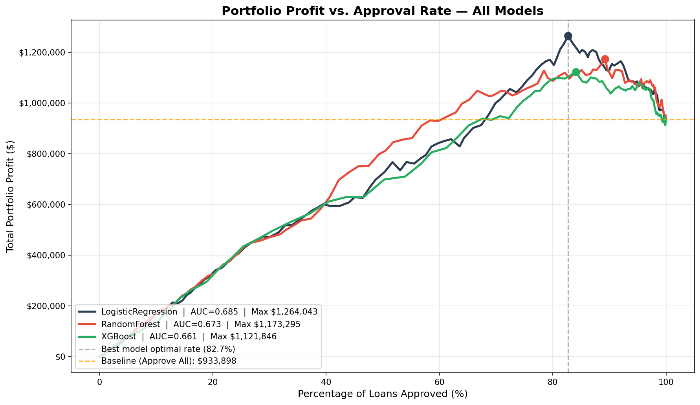

## Featured Case StudiesEstudos de Caso

::: {.grid}

::: {.g-col-12 .g-col-md-6}
### BreakPoint AI: ATP Tennis Forecasting

**Stack:** Python, PyTorch (LSTMs), Optuna, XGBoost, Scikit-Learn, SHAP

**The Problem:****O Problema:** Static features can't capture momentum. A player's last 10 matches tell a different story than their season average — but standard tabular models treat both identically.Features estáticas não capturam momentum. As últimas 10 partidas de um jogador contam uma história diferente da média na temporada — mas modelos tabulares padrão tratam ambas de forma idêntica.

**The Solution:****A Solução:** A **Hybrid Siamese LSTM** that models each match as the collision of two historical momentum trajectories, with strict temporal validation eliminating look-ahead bias at every step.Um **Hybrid Siamese LSTM** que modela cada partida como a colisão de duas trajetórias históricas de momentum, com validação temporal rigorosa eliminando look-ahead bias em cada etapa.

* **Innovation:****Inovação:** Siamese LSTM matched an engineered baseline using only raw sequential data — the model learns rolling statistics automatically without manual feature construction.O Siamese LSTM igualou uma baseline engenheirada usando apenas dados sequenciais brutos — o modelo aprende estatísticas de janela deslizante automaticamente.
* **Result:****Resultado:** Stacking ensemble achieved **0.717 AUC** and **65.5% accuracy** on the unseen 2024 test season across 90,000+ ATP records.Ensemble de stacking atingiu **0,717 AUC** e **65,5% de acurácia** no conjunto de teste 2024 com mais de 90.000 registros ATP.

[**View Technical Report →****Ver Relatório Técnico →**](./tennis-forecast/index.html){.btn .btn-primary}
:::

::: {.g-col-12 .g-col-md-6}
### Credit Risk Optimization Engine: Profit-First Loan ScoringMotor de Otimização de Risco de Crédito: Scoring Orientado a Lucro

**Stack:** Python, Scikit-Learn, XGBoost, Pandas, SHAP, Financial Engineering

**The Problem:****O Problema:** Standard classification models maximize *accuracy*, but banks care about *profit*. A model with 84% accuracy that predicts "fully paid" for almost every applicant is not better than approving everyone — it just looks better on a confusion matrix.Modelos padrão maximizam *acurácia*, mas bancos se importam com *lucro*. Um modelo com 84% de acurácia que prevê "pago" para quase todos não é melhor do que aprovar todos — apenas parece melhor em uma matriz de confusão.

**The Solution:****A Solução:** A custom profit function derived from the loan's P&L structure replaces accuracy as the optimization target. A strategy curve searches 200 threshold candidates to find the empirically optimal approval rate per model.Uma função de lucro derivada da estrutura de P&L do empréstimo substitui a acurácia como alvo de otimização. Uma curva de estratégia pesquisa 200 candidatos de threshold para encontrar a taxa ótima de aprovação por modelo.

* **Key insight:****Insight principal:** The model with the lowest accuracy (64%) produced the highest portfolio profit — by $142,197 over XGBoost's 84% accuracy.O modelo com menor acurácia (64%) produziu o maior lucro de portfólio — $142.197 a mais que o XGBoost com 84% de acurácia.
* **Result:****Resultado:** **+35.4% ROI lift** ($1,264,043 portfolio profit) over the naive approve-all baseline on 9,578 LendingClub loans.**+35,4% de ganho de ROI** ($1.264.043 em lucro) sobre a baseline ingênua em 9.578 empréstimos.

[**View Full Analysis →****Ver Análise Completa →**](./Loan-Default-Prediction/index.html){.btn .btn-primary}
:::

::: {.g-col-12 .g-col-md-6}
### NYC Ride-Share Demand AnalysisAnálise de Demanda de Transporte em NYC

**Stack:** R (ggplot2, dplyr), Geospatial Analysis

**The Problem:****O Problema:** Drivers face a "Cold Start" problem: knowing where to position themselves *before* demand spikes to minimize unpaid wait times.Motoristas enfrentam o problema "Cold Start": saber onde se posicionar *antes* dos picos de demanda para minimizar tempo de espera não remunerado.

**The Solution:****A Solução:** I conducted a spatiotemporal analysis of 4.5M+ Uber pickups to identify high-density clusters and recurring time-based demand cycles.Realizei uma análise espaço-temporal de 4,5M+ corridas Uber para identificar clusters de alta densidade e ciclos recorrentes de demanda por horário.

* **Insight:****Insight:** Identified a non-linear demand surge on Thursdays (commuter vs. nightlife shifts).Identificado aumento não-linear de demanda às quintas-feiras (commuters vs. vida noturna).
* **Application:****Aplicação:** Developed heatmaps acting as "Pre-Surge" indicators for fleet positioning.Desenvolveu heatmaps como indicadores "Pré-Pico" para posicionamento de frota.

[**View Visual Analysis →****Ver Análise Visual →**](./Uber-NYC-Analysis/index.html){.btn .btn-primary}
:::

:::
