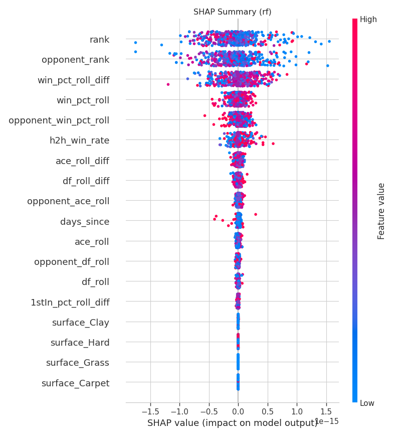
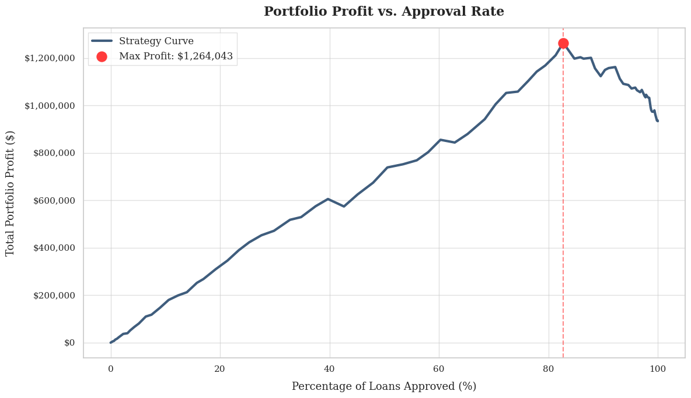
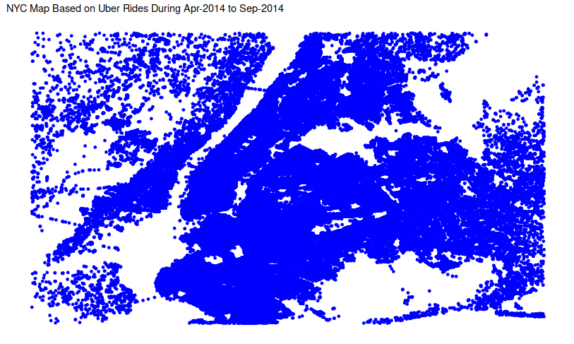

## Featured Case StudiesEstudos de Caso

::: {.grid}

::: {.g-col-12 .g-col-md-6}
### BreakPoint AI: ATP Tennis Forecasting

**Stack:** Python, PyTorch (LSTMs), Optuna, Time-Series Analysis

**The Problem:****O Problema:** Sports betting markets are highly efficient. Standard models fail to beat the "closing line" because they rely on static averages rather than dynamic form.Mercados de apostas esportivas são altamente eficientes. Modelos padrão falham em bater a linha de fechamento porque dependem de médias estáticas, não de forma dinâmica.

**The Solution:****A Solução:** I built a **Hybrid Siamese LSTM** network that models a match as the collision of two historical trajectories (momentum), rather than static player stats.Construí uma rede **Hybrid Siamese LSTM** que modela uma partida como a colisão de duas trajetórias históricas (momentum), em vez de estatísticas estáticas do jogador.

* **Innovation:****Inovação:** Strict `date < current_date` filtration to prevent look-ahead bias (data leakage).Filtragem rigorosa por data para evitar look-ahead bias (vazamento de dados).
* **Result:****Resultado:** Achieved **64.6% Accuracy** and **0.706 AUC**, reaching parity with institutional bookmakers.Alcançou **64,6% de Acurácia** e **0.706 AUC**, atingindo paridade com casas de apostas institucionais.

[**View Technical Report →****Ver Relatório Técnico →**](./tennis-forecast/index.html){.btn .btn-primary}
:::

::: {.g-col-12 .g-col-md-6}
### Optimizing Credit Risk: Profit-First LogicOtimizando Risco de Crédito: Lógica Profit-First

**Stack:** Python, Scikit-Learn, Pandas, Financial Engineering

**The Problem:****O Problema:** Standard classification models maximize *accuracy*, but banks care about *profit*. A default costs significantly more than a rejected loan saves.Modelos padrão maximizam *acurácia*, mas bancos se importam com *lucro*. Um default custa muito mais do que um empréstimo rejeitado economiza.

**The Solution:****A Solução:** I engineered a **Threshold Optimization Engine** that shifts the decision boundary based on the specific cost-benefit matrix of the loan portfolio.Desenvolvi um **Threshold Optimization Engine** que ajusta o limite de decisão com base na matriz custo-benefício específica do portfólio de empréstimos.

* **Strategy:****Estratégia:** Prioritized recall for high-risk segments.Priorizou recall para segmentos de alto risco.
* **Result:****Resultado:** Projected **~40% ROI lift** ($1.26M portfolio value) compared to standard accuracy-based thresholds.Projetou **~40% de aumento no ROI** (portfólio de $1,26M) em comparação com thresholds baseados em acurácia padrão.

[**View Full Analysis →****Ver Análise Completa →**](./Loan-Default-Prediction/index.html){.btn .btn-primary}
:::

::: {.g-col-12 .g-col-md-6}
### NYC Ride-Share Demand AnalysisAnálise de Demanda

**Stack:** R (ggplot2, dplyr), Geospatial Analysis

**The Problem:****O Problema:** Drivers face a "Cold Start" problem: knowing where to position themselves *before* demand spikes to minimize unpaid wait times.Motoristas enfrentam o problema "Cold Start": saber onde se posicionar *antes* dos picos de demanda para minimizar tempo de espera não remunerado.

**The Solution:****A Solução:** I conducted a spatiotemporal analysis of 4.5M+ Uber pickups to identify high-density clusters and recurring time-based demand cycles.Realizei uma análise espaço-temporal de 4,5M+ corridas Uber para identificar clusters de alta densidade e ciclos recorrentes de demanda por horário.

* **Insight:****Insight:** Identified a non-linear demand surge on Thursdays (commuter vs. nightlife shifts).Identificado aumento não-linear de demanda às quintas-feiras (commuters vs. vida noturna).
* **Application:****Aplicação:** Developed heatmaps acting as "Pre-Surge" indicators for fleet positioning.Desenvolveu heatmaps como indicadores "Pré-Pico" para posicionamento de frota.

[**View Visual Analysis →****Ver Análise Visual →**](./Uber-NYC-Analysis/index.html){.btn .btn-primary}
:::

:::
