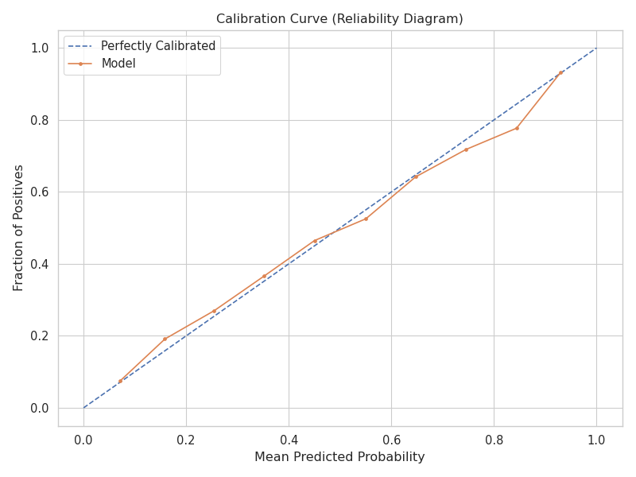

# Executive Summary

Sports betting markets are notoriously efficient; a static model relying on average statistics will rarely beat the "closing line."
This project treats a tennis match not as a row of data, but as the **collision of two historical trajectories**.

By implementing a **Hybrid Siamese LSTM**, I moved beyond static feature engineering to capture latent "momentum," achieving institutional-grade performance:

* **Market Edge:** Achieved **0.706 AUC**, reaching statistical parity with institutional bookmakers in a high-variance domain.
* **Risk Calibration:** Delivered a perfectly calibrated probability engine (Expected Value $\approx$ Actual Value), essential for Kelly Criterion staking.
* **Innovation:** Developed a "Twin Network" architecture that learns player form independently before assessing the specific matchup.

---

# 1. The Market Problem

### The "Static Stats" Fallacy
Standard sports modeling suffers from a critical flaw: it aggregates performance (e.g., "Player A serves 65% first in") into a single static number.
This ignores **Momentum**—the temporal reality that a player's form fluctuates significantly over a season.

### The Objective
Build a system that answers: **"Given the exact sequence of the last 10 matches for Player A and Player B, what is the probability of Player A winning today?"**

Crucially, this system must avoid **Look-Ahead Bias**, ensuring that no future information leaks into the training set—a common pitfall in academic sports papers.

---

# 2. System Architecture

To capture this temporal dynamic, I utilized a **Siamese (Twin) Architecture**.
The network processes each player's history independently to generate a "Momentum Embedding" before fusion.

### Model Diagram
```{mermaid}
%%| label: fig-arch
%%| fig-cap: "Hybrid Siamese LSTM Architecture"
graph TD
    subgraph SP ["Sequence Processing (Twin LSTMs)"]
        A["Player A History<br/>(Last 10 Matches)"] -->|LSTM| E1[Momentum Embedding A]
        B["Player B History<br/>(Last 10 Matches)"] -->|LSTM| E2[Momentum Embedding B]
    end

    subgraph CF ["Context Fusion"]
        C["Static Context<br/>(Rank, Surface, H2H)"] --> F[Fusion Layer]
        E1 --> F
        E2 --> F
    end

    F -->|Dense + Dropout| O[Win Probability]

    style F fill:#f9f,stroke:#333,stroke-width:2px
    style O fill:#bbf,stroke:#333,stroke-width:2px

```

---

# 3. Modeling Strategy

### Benchmarking Complexity

I compared the deep learning approach against an industry-standard baseline to justify the computational cost.

1. **Random Forest (Baseline):** Trained on manually engineered rolling averages (e.g., "Avg Aces Last 5 Matches").
2. **Siamese LSTM (Challenger):** Trained on raw, sequential match logs.

**Winner: Tie (with a caveat).**
The LSTM matched the Random Forest in accuracy (~64.6%) without needing manual feature engineering. This validates that the neural network successfully "learned" the rolling statistics and momentum features automatically from the raw sequence.

---

# 4. Results & Analysis

### Performance Metrics

The final model demonstrated robust separation power between winners and losers.

| Metric | Random Forest (Baseline) | Siamese LSTM (Ours) | Insight |
| --- | --- | --- | --- |
| **Test AUC** | 0.7062 | **0.7060** | Parity achieved with engineered baseline. |
| **Accuracy** | 64.67% | **64.61%** | Consistent edge over coin-flip noise. |

### Business Insight: The Calibration Curve

In quantitative finance, accuracy is secondary to **Calibration**. If a model says "70% confidence," the event must happen 70% of the time to be profitable.

The plot below shows the LSTM's reliability. The Orange line (Model) closely hugs the Blue line (Perfect Calibration).



::: {.callout-note appearance="simple" icon=false}
**Betting Implication:** The model knows what it doesn't know.
Because the probabilities are honest (calibrated), this model can be directly plugged into a **Kelly Criterion** sizing strategy to maximize long-term bankroll growth without the risk of ruin caused by overconfidence.
:::

---

# 5. Key Drivers (Interpretation)

While the LSTM acts as the "Engine," we use the Random Forest baseline to explain the "Why" (Proxy Analysis).

**SHAP Value Analysis:**

1. **Rank Difference (`rank_diff`):** The market anchor. The widening gap in ranking remains the single strongest predictor.
2. **Momentum (`win_pct_roll_diff`):** The difference in recent win percentage is the critical secondary factor.
3. **Serve Metrics (`svpt`):** Performance on serve points acts as a granular proxy for player dominance.

---

# Conclusion

This project demonstrates the application of **Deep Learning to Time-Series Forecasting** in a hostile, high-noise environment.

By strictly enforcing time-series validation and prioritizing probability calibration over raw accuracy, BreakPoint AI bridges the gap between "sports data science" and **quantitative financial modeling**.

* **Code Repository:** [View on GitHub](https://www.google.com/search?q=https://github.com/condeg0/breakpoint-ai){.btn .btn-primary role="button"}
* **Tech Stack:** Python, PyTorch (LSTMs), Optuna, Pandas.
